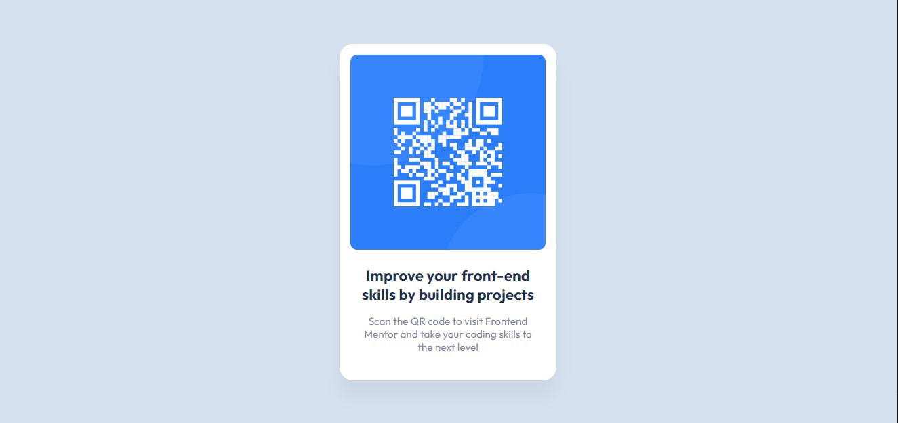

# QR-code-component
This is a solution to the [QR-code-component](https://github.com/robertshamiriani/QR-code-component/).
## Table of contents

- [Overview](#overview)
  - [The challenge](#the-challenge)
  - [Screenshot](#screenshot)
  - [Links](#links)
- [My process](#my-process)
  - [Built with](#built-with)
  - [Continued development](#continued-development)
  - [Useful resources](#useful-resources)
- [Author](#author)
- [Acknowledgments](#acknowledgments)

## Overview

### The challenge

-  challenges help you improve your coding skills by building realistic projects.
- The designs are in JPG static format. Using JPGs will mean that you'll need to use your best judgment for styles such as `font-size`, `padding` and `margin`
- **To do this challenge, you need a basic understanding of HTML and CSS.**
- You can use any tools you like to help you complete the challenge. So if you've got something you'd like to practice, feel free to give it a go.
- Want some support on the challenge? [Join our BitCamp community](https://facebook.com/groups/bitcamp.ge/permalink/8389844074389186/) and ask questions.

### Screenshot

### Links

- Solution URL: [GitHub Repository](https://github.com/robertshamiriani/QR-code-component)
- Live Site URL: [GitHub Page](https://robertshamiriani.github.io/QR-code-component/)

## My process

### Built with

- Semantic HTML5 markup
- CSS custom properties

### Continued development

I will create more projects to show you my developer skills

### Useful resources

- [Bitcamp Youtube channel](https://www.youtube.com/watch?v=YNnKzy8O4J8&list=PLinr8mxnrkqt1ht16YTb2FbbywWy3SQ4N) 

## Author

- Linkedin - [Robert Shamiriani](https://www.linkedin.com/in/robert-shamiriani-1b6117205/)

## Acknowledgments

- Thanks to BitCamp!
- Especially [Oto Zakalashvili](https://www.linkedin.com/in/otarza/)

- BitCamp: [Facebook Page](https://facebook.com/groups/bitcamp.ge/permalink/8389844074389186/)
                                                             
                                                             
                                                             
 
